# BPA Analytics Cowork Plugin

> **15 AI skills for CFO & Finance teams** — connects GitHub Copilot and M365 Copilot to Dynamics 365 Business Performance Analytics via live DAX queries. No dashboards, no exports.

---

## Who is this for?

| Persona | What they get |
|---|---|
| **CFO / Finance Director** | Executive KPI dashboard, financial health scorecard, board-ready summaries |
| **Finance Controller** | P&L by entity/dimension, trial balance, period-end close status |
| **FP&A Analyst** | Budget vs actuals variance, trend analysis, forecast vs actual |
| **AP / Procurement** | Vendor spend ranking, OTIF, AP aging, DPO monitoring |
| **AR / Revenue** | AR aging by bucket, DSO trend, overdue invoice alerts |
| **Revenue Manager** | Revenue by customer/product, Pareto concentration risk, YoY growth trends |
| **Asset Controller** | Fixed asset register, net book value, depreciation run, capex execution rate |

---

## What this plugin does

The BPA Analytics Cowork Plugin provides **15 AI skills** that translate plain-English finance questions into DAX queries executed directly against your **Dynamics 365 Business Performance Analytics** Power BI dataset.

```
Finance question  ──►  BPA skill       ──►  BPA MCP tools    ──►  Structured result
(plain English)        (routes intent)      (DAX queries)         (in chat window)
```

No dashboards to navigate. No exports. Just ask your AI assistant.

---

## Architecture

```mermaid
flowchart LR

    subgraph USERS["👥  Users"]
        direction TB
        CFO(["💼  CFO / Finance Director\nKPI dashboard · scorecard\nboard report · EBITDA"])
        CTRL(["📊  Finance Controller\nP&L · trial balance\nperiod close · recon"])
        FPA(["📈  FP&A / Director\nBudget vs actuals\nspending behaviour"])
        ARAP(["🧾  AR / AP / Treasurer\nAging · DSO · DPO\ncash flow projection"])
        PROC(["🛒  Procurement\nVendor spend · OTIF\ncategory analysis"])
        REV(["💹  Revenue Manager\nRevenue by customer\nPareto · growth"])
        ASSET(["🏭  Asset Controller\nNBV · depreciation\ncapex execution"])
    end

    subgraph PLUGIN["🔌  BPA Analytics Cowork Plugin  —  14 SKILL.md files"]
        direction TB
        subgraph R2R["Record-to-Report"]
            S1["bpa-financial-performance\nP&L · gross margin · EBITDA"]
            S2["bpa-budget-variance\nBudget vs actuals · variance"]
            S3["bpa-period-close\nClose checklist · subledger recon"]
            S6["bpa-executive-kpis\nCFO dashboard · scorecard"]
            S7["bpa-intercompany\nGL by entity · anomaly detection"]
            S9["bpa-spending-behavior\nSpend vs budget · causal analysis"]
            S11["bpa-cost-center-profitability\nCost center P&L · margin"]
            S14["bpa-fixed-assets-capex\nNBV · depreciation · capex"]
        end
        subgraph P2P["Procure-to-Pay"]
            S4["bpa-vendor-performance\nVendor spend · OTIF · categories"]
            S8["bpa-cash-flow-projection\n30/60/90-day · liquidity gap"]
        end
        subgraph O2C["Order-to-Cash"]
            S5["bpa-cash-flow-ar-ap\nAR/AP aging · DSO · DPO"]
            S13["bpa-revenue-analysis\nRevenue by customer · Pareto"]
        end
        subgraph CROSS["Cross-domain"]
            S10["bpa-roi-capital\nROI · budget execution · scenarios"]
            S12["bpa-working-capital\nCCC · DSO/DIO/DPO · NWC"]
        end
    end

    subgraph DEPLOY["⚙️  Deployment options"]
        direction TB
        OA["A — Skills-only\nPrompts folder copy\nNo server needed"]
        OB["B — VS Code mcp.json\ntype: http · Azure AD\nLocal MCP connection"]
        OC["C — M365 Copilot\nmanifest.json upload\nOAuthPluginVault"]
    end

    subgraph MCPSVR["☁️  BPA MCP Server  (Microsoft-hosted · Power Platform)"]
        direction TB
        EP["agent365.svc.cloud.microsoft\nmsdyn_ERPAnalyticsMCPServer\nAzure AD · BPA User role"]
        subgraph TOOLS["2 MCP tools"]
            direction LR
            T1["get_bpa_dataset_schema\nDiscover tables & columns"]
            T2["execute_dax_query\nRun DAX EVALUATE queries"]
        end
        EP --> T1 & T2
    end

    subgraph BPA["🗄️  Dynamics 365 Business Performance Analytics"]
        direction TB
        D1["📋 Record-to-Report\nGeneral Ledger · P&L · Budget"]
        D2["🛒 Procure-to-Pay\nVendor Invoices · AP Aging"]
        D3["💰 Order-to-Cash\nCustomer Invoices · AR Aging"]
    end

    CFO & CTRL & FPA & ARAP & PROC & REV & ASSET -->|"plain-English prompt"| PLUGIN
    PLUGIN --> OA & OB & OC
    OB -->|"HTTP · Azure AD"| EP
    OC -->|"HTTP · OAuthPluginVault"| EP
    T1 & T2 -->|"DAX / Power BI REST"| D1 & D2 & D3
    D1 & D2 & D3 -->|"query results"| T1 & T2

    classDef user   fill:#1e3a5f,stroke:#4fa3e0,color:#cce5ff
    classDef r2r    fill:#0d3068,stroke:#4fa3e0,color:#fff
    classDef p2p    fill:#1a2a3a,stroke:#4fa3e0,color:#cce5ff
    classDef o2c    fill:#0a2040,stroke:#4fa3e0,color:#cce5ff
    classDef cross  fill:#0d2040,stroke:#6abf69,color:#cfffce
    classDef deploy fill:#1e3a1e,stroke:#6abf69,color:#cfffce
    classDef ep     fill:#003366,stroke:#4fa3e0,color:#fff
    classDef tool   fill:#001a33,stroke:#4fa3e0,color:#99ccff
    classDef bpa    fill:#005a9e,stroke:#4fa3e0,color:#fff
    class CFO,CTRL,FPA,ARAP,PROC,REV,ASSET user
    class S1,S2,S3,S6,S7,S9,S11,S14 r2r
    class S4,S8 p2p
    class S5,S13 o2c
    class S10,S12 cross
    class OA,OB,OC deploy
    class EP ep
    class T1,T2 tool
    class D1,D2,D3 bpa
```



> Mermaid source: [architecture.mmd](architecture.mmd)

---

## Repository structure

```
bpa-cowork-plugin/
├── manifest.json               M365 App Manifest v1.28
├── bpa-mcp-tools.json          BPA MCP tools schema (v2.1)
├── package.ps1                 ASKILL validation + ZIP packager
├── architecture.mmd            Mermaid architecture diagram (rendered in README)
├── color.png                   192x192 colour icon
├── outline.png                 32x32 outline icon
├── README.md                   This file
├── EXAMPLES.md                 Usage examples for all personas
├── CHANGELOG.md
├── CONTRIBUTING.md
├── PRIVACY.md
├── SECURITY.md
├── LICENSE
└── skills/
    ├── bpa-financial-performance/SKILL.md   P&L, gross margin, EBITDA, R2R
    ├── bpa-cash-flow-ar-ap/SKILL.md         Cash flow, AR/AP aging, DSO, DPO
    ├── bpa-budget-variance/SKILL.md         Budget vs actuals, FP&A variance
    ├── bpa-vendor-performance/SKILL.md      Vendor spend, OTIF, procurement
    ├── bpa-period-close/SKILL.md            Period-close status, subledger recon
    ├── bpa-executive-kpis/SKILL.md          CFO dashboard, board KPIs, scorecard
    ├── bpa-intercompany/SKILL.md            Intercompany GL, anomaly detection
    ├── bpa-cash-flow-projection/SKILL.md    30/60/90-day projection, liquidity gap
    ├── bpa-spending-behavior/SKILL.md       Spend vs budget, causal analysis
    ├── bpa-roi-capital/SKILL.md             ROI, budget execution, capital scenarios
    ├── bpa-cost-center-profitability/SKILL.md  Cost center P&L, dept margin, allocation
    ├── bpa-working-capital/SKILL.md         CCC, DSO/DIO/DPO, NWC ratios
    ├── bpa-revenue-analysis/SKILL.md        Revenue by customer/product, Pareto, growth
    ├── bpa-fixed-assets-capex/SKILL.md      Fixed assets NBV, depreciation, capex vs opex
    └── bpa-ppt-report/SKILL.md              PowerPoint board deck orchestrator (Cowork)
```

---

## Skills

| Skill | BPA coverage | Key personas |
|---|---|---|
| `bpa-financial-performance` | Record-to-Report | Controller, FP&A |
| `bpa-cash-flow-ar-ap` | Order-to-Cash, Procure-to-Pay | Treasurer, AR/AP |
| `bpa-budget-variance` | Record-to-Report | FP&A, Finance Director |
| `bpa-vendor-performance` | Procure-to-Pay | Procurement, AP |
| `bpa-period-close` | Record-to-Report | Controller, Shared Services |
| `bpa-executive-kpis` | All three domains | CFO, Board |
| `bpa-intercompany` | Record-to-Report, Procure-to-Pay | Senior Analyst, Controller |
| `bpa-cash-flow-projection` | Order-to-Cash, Procure-to-Pay | Manager, Treasurer |
| `bpa-spending-behavior` | Record-to-Report | FP&A Director, Operational Director |
| `bpa-roi-capital` | All three domains | CFO, Finance Director |
| `bpa-cost-center-profitability` | Record-to-Report | Management Accountant, Controller |
| `bpa-working-capital` | O2C, P2P, Record-to-Report | Treasurer, Finance Director |
| `bpa-revenue-analysis` | Order-to-Cash | Revenue Manager, Sales Finance, CFO |
| `bpa-fixed-assets-capex` | Record-to-Report | Asset Controller, Finance Controller |
| `bpa-ppt-report` | All domains (orchestrator) | CFO, Finance Director, Board |

---

## Deployment options

| Option | Where it runs | Skill access | Auth |
|---|---|---|---|
| **A — Skills only** | VS Code prompts folder | Copilot answers from skill instructions (no live data) | None |
| **B — VS Code mcp.json** | Local HTTP connection | Live DAX queries in VS Code | Azure AD (MSAL device flow) |
| **C — M365 Copilot (Cowork)** | manifest.json upload to M365 Admin | Full plugin experience + PowerPoint creation | OAuthPluginVault (Entra ID) |

---

## Licence requirements

- **Dynamics 365 Finance** licence (includes BPA access).
- **BPA User** role assigned in the Power Platform environment where BPA is deployed.
- For Option C (M365 Copilot): **Microsoft 365 Copilot** licence + **Copilot Studio capacity** (message credits) — required since Cowork reached general availability.

---

## Option C — M365 Copilot (Cowork activation)

> **Cowork is already built into M365 Copilot.**  
> Microsoft ships Cowork as part of Microsoft 365 Copilot — it is the extensibility layer that lets organisations activate third-party and custom agents alongside Microsoft’s native ones. You do not need to install or configure Cowork itself. Your **M365 Global Admin or Teams Admin** simply uploads the BPA Analytics plugin package to the M365 Admin Center and assigns it to the Finance security group. Once assigned, the plugin appears in the Copilot sidebar for your Finance users — no client-side setup required.

**User experience after your admin activates the plugin:**

1. In M365 Copilot (web) or Teams, open the Copilot panel → the **BPA Analytics** agent appears in the sidebar under your organisation’s agents.
2. Ask any finance question: *“Show me the P&L for last month”* or *“Which vendors are over budget?”*
3. M365 Copilot routes the question to the matching BPA skill, calls the BPA MCP tools on your behalf, and streams the structured result in chat.
4. On first use, a consent screen prompts sign-in with Azure AD. The token is cached — no re-auth on subsequent sessions.

---

### 1. Prepare the manifest

Edit `manifest.json`:
- Replace `YOUR_ENVIRONMENT_ID` in `mcpServerUrl` with your Power Platform environment ID (find it in https://admin.powerplatform.microsoft.com → your environment → Settings → Session details → Environment ID).
- Replace `YOUR_OAUTH_REGISTRATION_ID` with the reference ID from Teams Developer Portal after registering the OAuth connection.

### 2. Register the OAuth connection (Teams Developer Portal)

1. Go to https://dev.teams.microsoft.com → **Connectors** → **OAuth registrations**.
2. Create a new registration:
   - **Token endpoint**: `https://login.microsoftonline.com/{your-tenant-id}/oauth2/v2.0/token`
   - **Scopes**: `https://service.powerapps.com/.default`
3. Copy the generated **Reference ID** into `manifest.json → referenceId`.

### 3. Build the ZIP

```powershell
.\package.ps1
```

Produces `bpa-analytics-cowork.zip` (all ASKILL checks must pass).

### 4. Upload to M365 Admin Center

1. Go to https://admin.microsoft.com → **Settings** → **Integrated apps** → **Upload custom app**.
2. Select `bpa-analytics-cowork.zip`.
3. Assign to pilot users or your Finance security group.

### 5. Validate in Microsoft 365 Copilot

Ask: *"Show me the BPA plugin tools available."*  
Expected: the assistant lists `get_bpa_dataset_schema` and `execute_dax_query`.

### 6. First use — authentication

When the plugin first calls the BPA MCP server, M365 Copilot will prompt for consent. Users sign in with their Azure AD account. The token is cached — no re-authentication on subsequent sessions.

### 7. Updating the plugin

Bump `version` in `manifest.json`, run `.\package.ps1`, re-upload the ZIP in M365 Admin Center. Assigned users receive the update automatically.

---

## Extending your Cowork agent

### Adding a new BPA skill

1. Create a folder under `skills/` — e.g. `skills/bpa-supply-chain/`.
2. Add `SKILL.md` with valid ASKILL frontmatter (`name:`, `description:`, `license: MIT`) and a body ≥ 200 characters.
3. Document the DAX workflow following the same pattern as existing skills.
4. Add `{"folder": "./skills/bpa-supply-chain"}` to `agentSkills` in `manifest.json`.
5. Bump `version` in `manifest.json`.
6. Run `.\package.ps1` — all ASKILL checks must pass.
7. Re-upload the ZIP in M365 Admin Center.

### Creating a PowerPoint board deck from BPA data

M365 Copilot can natively create PowerPoint presentations and save them to OneDrive. You can chain BPA data retrieval with Copilot’s deck-creation capability to produce board-ready financial presentations directly from live data — with a single prompt.

**How it works in Cowork:**

```
User: “Create a CFO board deck with Q2 2026 financial highlights.”
  │
  ├── bpa-ppt-report skill activates
  ├── Step 1: fetches P&L from bpa-financial-performance → execute_dax_query
  ├── Step 2: fetches budget variance from bpa-budget-variance → execute_dax_query
  ├── Step 3: fetches 90-day outlook from bpa-cash-flow-projection → execute_dax_query
  ├── Step 4: fetches KPI scorecard from bpa-executive-kpis → execute_dax_query
  └── Step 5: instructs M365 Copilot to create a .pptx in OneDrive → link returned in chat
```

This repo includes the ready-to-use `bpa-ppt-report` skill ([skills/bpa-ppt-report/SKILL.md](skills/bpa-ppt-report/SKILL.md)) which handles the orchestration and slide template instruction layer.

**Default output — 6-slide deck:**

| Slide | Content | BPA source |
|---|---|---|
| 1 | Cover — company, period, date | — |
| 2 | P&L summary — Revenue, Gross Margin, EBITDA, Net Income | bpa-financial-performance |
| 3 | Budget vs actuals — YTD variance waterfall | bpa-budget-variance |
| 4 | Cash flow outlook — 30/60/90 days | bpa-cash-flow-projection |
| 5 | CFO KPI scorecard — RAG status | bpa-executive-kpis |
| 6 | AI-generated recommendations + next steps | AI reasoning |

**Example prompts:**

> *“Create a board presentation with this month’s KPIs.”*  
> *“Generate a CFO deck for H1 2026 with revenue breakdown and budget variance.”*  
> *“Build a QBR presentation for the Finance Director — include working capital metrics.”*

> **Note**: PowerPoint file creation requires Option C (M365 Copilot / Cowork). In Options A and B, the skill outputs a structured Markdown outline that you can paste into Copilot in the PowerPoint app to generate the deck.

---

## Option B — Quick start (VS Code)

Add to `%APPDATA%\Code\User\mcp.json`:

```jsonc
{
  "servers": {
    "BPA-Analytics": {
      "url": "https://agent365.svc.cloud.microsoft/mcp/environments/YOUR_ENVIRONMENT_ID/servers/msdyn_ERPAnalyticsMCPServer",
      "type": "http"
    }
  }
}
```

Then run `.\package.ps1 -SkillsOnly` to copy the skills to your VS Code prompts folder.  
Reload VS Code — the BPA skills appear in Copilot Chat automatically.

---

## Option A — Skills only (no live data)

```powershell
.\package.ps1 -SkillsOnly
```

Copies `skills/` to `%APPDATA%\Code\User\prompts\bpa-analytics`.  
Skills guide the AI assistant using DAX examples but cannot query live BPA data without an MCP connection.

---

## Security

See [SECURITY.md](SECURITY.md). In brief:
- No credentials are stored in any file in this repository.
- Option B: Azure AD session managed by VS Code — no PAT required.
- Option C: OAuthPluginVault — tokens never written to disk or source code.
- Minimum required role: **BPA User** in the target Power Platform environment.

## Privacy

See [PRIVACY.md](PRIVACY.md). No data is collected by the plugin authors. All queries travel between your AI assistant and your own Power Platform environment.

## Contributing

See [CONTRIBUTING.md](CONTRIBUTING.md). New skills for additional BPA domains (e.g. Supply Chain, Inventory) are very welcome.

## License

[MIT](LICENSE) — Copyright (c) 2026 Aurelien Clere